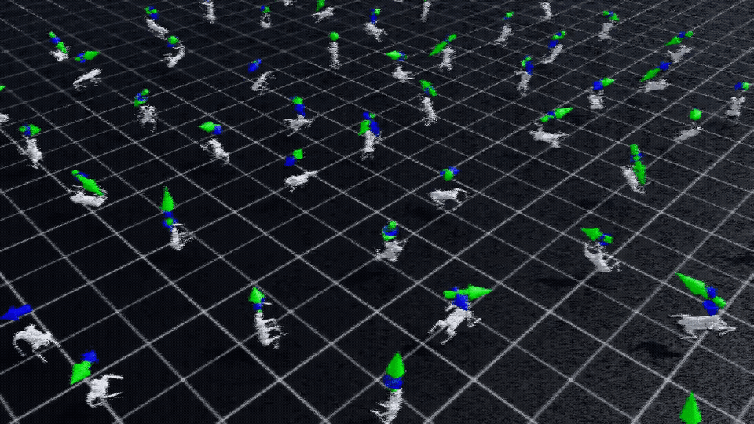
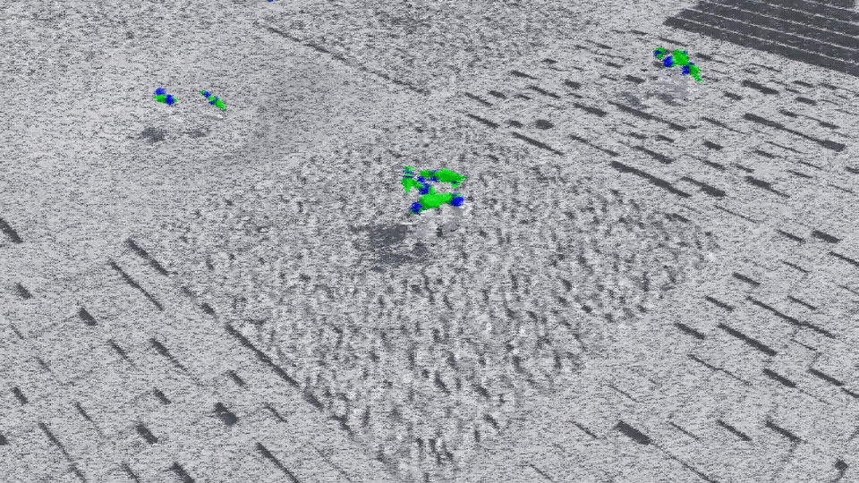
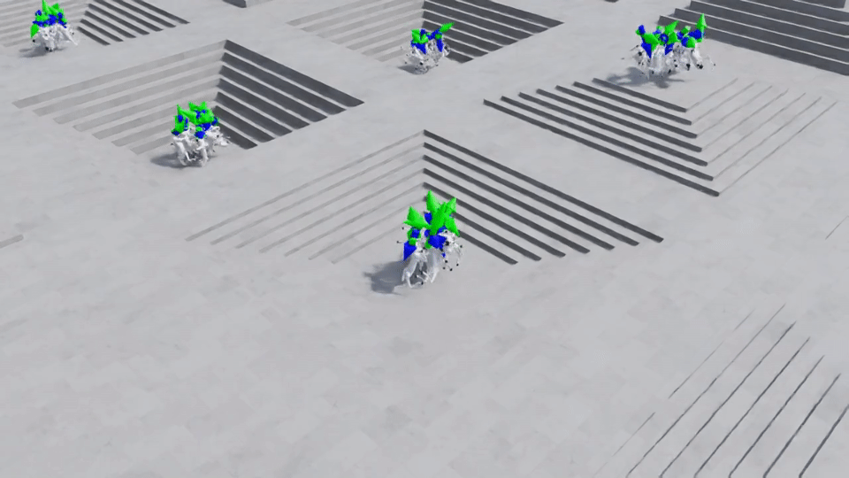

# robot_lab: Branch Notes for `exp/go2-train`

This README is branch-specific.

- Branch: `exp/go2-train`
- Goal: record only our own work on Unitree Go2 training
- Policy: keep the upstream/original README on `main`; use experiment branches to document what we actually ran, what worked, and what we plan to change next

## Scope

This branch is for:

- Go2 flat-terrain training experiments
- Go2 rough-terrain training experiments
- Go2 stairs-only training experiments
- local reproduction notes
- training result snapshots
- follow-up improvement ideas
- migration notes for later rough-terrain or deployment work

This branch is not trying to be a full project introduction. For the original upstream project description, use `main`.

## Current Reproduction Status

Current branch conclusion:

- training is reproducible locally
- the Go2 flat policy improves during training
- playback is not yet clean enough to consider the reproduction "solved"

Current playback artifact:

- clickable gif preview: [](docs/branch_artifacts/go2_flat_full_reproduction_2026-03-19.mp4)
- video: `docs/branch_artifacts/go2_flat_full_reproduction_2026-03-19.mp4`
- rough-terrain gif preview: [](docs/branch_artifacts/go2_rough_full_reproduction_2026-03-20.mp4)
- rough-terrain video: `docs/branch_artifacts/go2_rough_full_reproduction_2026-03-20.mp4`
- rough-terrain gif preview after re-enabling `illegal_contact`: [](docs/branch_artifacts/go2_rough_illegal_contact_on_reproduction_2026-03-24.mp4)
- rough-terrain video after re-enabling `illegal_contact`: `docs/branch_artifacts/go2_rough_illegal_contact_on_reproduction_2026-03-24.mp4`
- stairs-only gif preview: [](docs/branch_artifacts/go2_stairs_full_reproduction_2026-03-25.mp4)
- stairs-only video: `docs/branch_artifacts/go2_stairs_full_reproduction_2026-03-25.mp4`

Observed behavior in the current playback:

- some Go2 instances fall very early
- after falling, several robots remain in a near-static state instead of recovering
- this means the current branch should be treated as a partially successful reproduction, not a final result

Current root-cause hypothesis from environment inspection:

- the earlier Go2 rough configuration disabled `illegal_contact` termination during play and training
- because of that, a robot that falls could remain in the same episode instead of being reset immediately
- this was the clearest explanation for the "fall early and then stay inactive" behavior seen in the first rough-terrain playback
- the current branch now includes a comparison run with `illegal_contact` re-enabled so future iterations can measure the effect of that single change

## Local Setup Used

The runs on this branch were reproduced with the following local setup:

- Isaac Sim binary: `5.1.0`
- Isaac Lab: `v2.3.2`
- Python: `3.11`
- Conda env: `env_isaaclab`
- GPU: `RTX 4090 D`

Useful shell entrypoints:

```bash
use_isaaclab
use_robot_lab
```

`use_isaaclab` activates the conda env and sources Isaac Sim.

`use_robot_lab` does the same and then changes into this repository root.

## Current Configuration Snapshot

This section records the current baseline configuration before we start modifying the environment.

Primary reference target:

- rough-terrain Go2 training environment
- task id: `RobotLab-Isaac-Velocity-Rough-Unitree-Go2-v0`
- flat and stairs-only tasks are treated as derived variants of the same setup

### 1. Scene and simulation

Inherited base environment settings:

- scene type: manager-based RL environment
- default environment count: `4096`
- default env spacing: `2.5`
- simulation dt: `0.005`
- decimation: `4`
- environment step dt: `0.02`
- episode length: `20.0 s`
- render interval: `4`

Terrain and sensors in the rough task:

- terrain type: generated rough terrain
- terrain curriculum in base env: enabled when terrain curriculum term exists
- terrain importer max init terrain level: `5`
- height scanner: enabled
- contact force sensor: enabled with `history_length=3` and `track_air_time=True`

Terrain and sensors in the flat task:

- terrain replaced with a plane
- terrain generator disabled
- height scanner disabled
- terrain curriculum disabled

Terrain and sensors in the stairs-only task:

- terrain type: generated terrain
- only `pyramid_stairs` and `pyramid_stairs_inv` are kept
- both stair sub-terrains use `proportion = 0.5`
- all other rough sub-terrains are set to `0.0`
- height scanner remains enabled
- terrain curriculum remains enabled

### 2. Robot asset and actuator settings

Current robot asset is `UNITREE_GO2_CFG`.

Robot initialization:

- base initial position: `(0.0, 0.0, 0.38)`
- default joint posture:
  - hip: `0.0`
  - thigh: `0.8`
  - calf: `-1.5`
- default joint velocity: all zeros

Robot spawn and articulation settings:

- asset source: local Go2 URDF
- fixed base: disabled
- merge fixed joints: enabled
- self collisions: disabled
- solver position iterations: `4`
- solver velocity iterations: `0`
- gravity: enabled
- linear damping: `0.0`
- angular damping: `0.0`
- max depenetration velocity: `1.0`

Actuator settings:

- actuator type: `DCMotorCfg`
- effort limit: `23.5`
- saturation effort: `23.5`
- velocity limit: `30.0`
- stiffness: `25.0`
- damping: `0.5`
- friction: `0.0`

### 3. Command configuration

Base velocity command generator:

- command type: `UniformThresholdVelocityCommand`
- resampling time: `10.0 s`
- relative standing envs: `0.02`
- relative heading envs: `1.0`
- heading command: enabled
- heading control stiffness: `0.5`

Command ranges:

- `lin_vel_x`: `[-1.0, 1.0]`
- `lin_vel_y`: `[-1.0, 1.0]`
- `ang_vel_z`: `[-1.0, 1.0]`
- heading: `[-pi, pi]`

Command post-processing:

- small planar commands are zeroed if xy command norm is `<= 0.2`
- pit-aware restriction logic exists in the command generator

### 4. Observation configuration

Policy observations in the base env:

- base linear velocity
- base angular velocity
- projected gravity
- generated velocity commands
- joint position relative to default
- joint velocity
- previous action
- height scan

Base observation corruption:

- policy corruption: enabled in the generic base env
- critic corruption: disabled
- policy and critic both concatenate terms

Go2 rough overrides for policy observations:

- `base_lin_vel` removed from policy observations
- `height_scan` removed from policy observations
- policy scales:
  - `base_ang_vel = 0.25`
  - `joint_pos = 1.0`
  - `joint_vel = 0.05`
- policy joint order restricted to the 12 Go2 leg joints

Go2 rough critic observations:

- critic still keeps richer state than the policy
- critic keeps base linear velocity and height scan from the base environment definition

Flat-task observation difference:

- flat task also removes height-scan related observations because the terrain is a plane

Stairs-task observation difference:

- no observation change relative to the current rough task
- the experiment isolates terrain composition instead of changing observation design

### 5. Action configuration

Base action type:

- joint position action with default offsets enabled

Go2 rough action overrides:

- hip joints action scale: `0.125`
- all non-hip joints action scale: `0.25`
- action clip: `(-100.0, 100.0)`
- controlled joints: the 12 Go2 leg joints only

### 6. Randomization and events

Startup randomization:

- rigid body material randomization:
  - static friction: `(0.3, 1.0)`
  - dynamic friction: `(0.3, 0.8)`
  - restitution: `(0.0, 0.5)`
  - buckets: `64`
- rigid body mass randomization for base:
  - operation: `add`
  - range: `(-1.0, 3.0)`
- rigid body mass randomization for other bodies:
  - operation: `scale`
  - range: `(0.7, 1.3)`
- COM randomization:
  - `x/y/z`: `(-0.05, 0.05)`

Reset randomization in the base env:

- external force and torque applied at reset:
  - force: `(-10.0, 10.0)`
  - torque: `(-10.0, 10.0)`
- joint reset by scale:
  - position range: `(1.0, 1.0)`
  - velocity range: `(0.0, 0.0)`
- actuator gain randomization:
  - stiffness scale: `(0.5, 2.0)`
  - damping scale: `(0.5, 2.0)`
- root state randomization:
  - `x/y`: `(-0.5, 0.5)`
  - yaw: `(-3.14, 3.14)`
  - linear and angular velocity: `(-0.5, 0.5)`

Go2 rough reset override:

- root pose randomization becomes much more aggressive:
  - `z`: `(0.0, 0.2)`
  - `roll`: `(-3.14, 3.14)`
  - `pitch`: `(-3.14, 3.14)`
  - `yaw`: `(-3.14, 3.14)`
- reset external force/torque is applied specifically to the base body
- mass randomization target bodies are split into base vs non-base bodies

Interval randomization:

- push-robot event every `10.0` to `15.0 s`
- planar push velocity range: `(-0.5, 0.5)`

### 7. Reward configuration

Current Go2 rough reward weights:

- `is_terminated = 0`
- `lin_vel_z_l2 = -2.0`
- `ang_vel_xy_l2 = -0.05`
- `flat_orientation_l2 = 0`
- `base_height_l2 = 0`
- `body_lin_acc_l2 = 0`
- `joint_torques_l2 = -2.5e-5`
- `joint_vel_l2 = 0`
- `joint_acc_l2 = -2.5e-7`
- `joint_pos_limits = -5.0`
- `joint_vel_limits = 0`
- `joint_power = -2e-5`
- `stand_still = -2.0`
- `joint_pos_penalty = -1.0`
- `joint_mirror = -0.05`
- `action_rate_l2 = -0.01`
- `undesired_contacts = -1.0`
- `contact_forces = -1.5e-4`
- `track_lin_vel_xy_exp = 3.0`
- `track_ang_vel_z_exp = 1.5`
- `feet_air_time = 0.1`
- `feet_air_time_variance = -1.0`
- `feet_contact = 0`
- `feet_contact_without_cmd = 0.1`
- `feet_stumble = 0`
- `feet_slide = -0.1`
- `feet_height = 0`
- `feet_height_body = -5.0`
- `feet_gait = 0.5`
- `upward = 1.0`

Reward details worth remembering:

- velocity tracking rewards are multiplied by an uprightness factor
- `stand_still` and `joint_pos_penalty` depend on command magnitude
- `joint_mirror` uses diagonal leg symmetry pairs
- `feet_gait` encourages trot-like synchronization:
  - `FL` with `RR`
  - `FR` with `RL`

Flat-task reward difference:

- flat task does not introduce a new reward table
- it mainly removes terrain-related components and then disables zero-weight rewards

### 8. Termination and curriculum configuration

Base terminations:

- `time_out`
- `terrain_out_of_bounds`
- `illegal_contact`

Current Go2 rough termination override:

- `illegal_contact` is enabled
- invalid contact bodies: `base` and `.*_hip`

This is important because the current comparison run restores reset-on-fall behavior for base and hip contacts.

Current curriculum state in Go2 rough:

- terrain curriculum: inherited from base rough env
- command curriculum for linear velocity: disabled
- command curriculum for angular velocity: disabled

Current curriculum state in Go2 flat:

- terrain curriculum: disabled
- command curricula: still disabled

Current curriculum state in Go2 stairs-only:

- terrain curriculum: inherited from base rough env
- command curricula: disabled

### 9. Current trainer configuration

RSL-RL Go2 rough trainer:

- `num_steps_per_env = 24`
- `max_iterations = 20000`
- `save_interval = 100`
- `experiment_name = unitree_go2_rough`

Policy network:

- actor hidden dims: `[512, 256, 128]`
- critic hidden dims: `[512, 256, 128]`
- activation: `elu`
- initial action noise std: `1.0`
- actor observation normalization: disabled
- critic observation normalization: disabled

PPO algorithm:

- `value_loss_coef = 1.0`
- `use_clipped_value_loss = True`
- `clip_param = 0.2`
- `entropy_coef = 0.01`
- `num_learning_epochs = 5`
- `num_mini_batches = 4`
- `learning_rate = 1e-3`
- `schedule = adaptive`
- `gamma = 0.99`
- `lam = 0.95`
- `desired_kl = 0.01`
- `max_grad_norm = 1.0`

Flat-task trainer difference:

- same PPO/trainer structure as rough
- `max_iterations = 5000`
- `experiment_name = unitree_go2_flat`

### 10. Baseline snapshot policy

For future comparisons, treat this section as the baseline before any custom environment modifications.

When we change any of the following, we should update this branch note explicitly:

- command ranges
- observation terms
- action scales
- startup/reset randomization
- reward weights
- termination logic
- curriculum logic
- trainer hyperparameters

## What We Ran

### 1. Go2 flat baseline

Command:

```bash
python scripts/reinforcement_learning/rsl_rl/train.py \
  --task=RobotLab-Isaac-Velocity-Flat-Unitree-Go2-v0 \
  --headless \
  --num_envs=64 \
  --max_iterations=50 \
  --run_name=go2_flat_baseline
```

Artifacts:

- checkpoint: `model_49.pt`

Recovered config summary:

- task: `RobotLab-Isaac-Velocity-Flat-Unitree-Go2-v0`
- device: `cuda:0`
- num envs: `64`
- decimation: `4`
- episode length: `20.0 s`
- iterations: `50`

Final recorded metrics:

- `Train/mean_reward = -4.0438`
- `Train/mean_episode_length = 571.51`
- `Episode_Reward/track_lin_vel_xy_exp = 0.0158`
- `Episode_Reward/track_ang_vel_z_exp = 0.0186`
- `Episode_Termination/time_out = 1.0`

Interpretation:

- this was enough to confirm the training pipeline runs end-to-end
- it was not enough for the policy to become good
- reward was still negative at the end of this short run

### 2. Go2 flat full run

Command:

```bash
python scripts/reinforcement_learning/rsl_rl/train.py \
  --task=RobotLab-Isaac-Velocity-Flat-Unitree-Go2-v0 \
  --headless \
  --num_envs=1024 \
  --run_name=go2_flat_full
```

Artifacts:

- final checkpoint: `model_4999.pt`
- playback video: `docs/branch_artifacts/go2_flat_full_reproduction_2026-03-19.mp4`

Recovered config summary:

- task: `RobotLab-Isaac-Velocity-Flat-Unitree-Go2-v0`
- device: `cuda:0`
- num envs: `1024`
- decimation: `4`
- episode length: `20.0 s`
- iterations: `5000`

Final recorded metrics:

- `Train/mean_reward = 43.7053`
- `Train/mean_episode_length = 1000.0`
- `Episode_Reward/track_lin_vel_xy_exp = 1.1316`
- `Episode_Reward/track_ang_vel_z_exp = 0.5762`
- `Episode_Termination/time_out = 1.0`

Interpretation:

- the policy clearly learned compared with the short baseline run
- the episode length reached the task horizon
- linear velocity tracking became strong
- angular velocity tracking improved, but still looks like an area worth tuning
- successful training metrics do not yet guarantee robust playback quality
- in the recorded playback, some robots still fall at the beginning and then remain inactive

### 3. Go2 rough full run

Command:

```bash
python scripts/reinforcement_learning/rsl_rl/train.py \
  --task=RobotLab-Isaac-Velocity-Rough-Unitree-Go2-v0 \
  --headless \
  --num_envs=1024 \
  --run_name=go2_rough_full
```

Artifacts:

- playback video: `docs/branch_artifacts/go2_rough_full_reproduction_2026-03-20.mp4`

Interpretation:

- this preserved the original rough-terrain behavior before changing termination logic
- it is the reference playback for comparing later environment edits

### 4. Go2 rough run with `illegal_contact` re-enabled

Code change:

```python
self.terminations.illegal_contact.params["sensor_cfg"].body_names = [self.base_link_name, ".*_hip"]
```

Training command:

```bash
python scripts/reinforcement_learning/rsl_rl/train.py \
  --task=RobotLab-Isaac-Velocity-Rough-Unitree-Go2-v0 \
  --headless \
  --num_envs=1024 \
  --run_name=go2_rough_illegal_contact_on
```

Playback artifacts:

- latest checkpoint used for playback: `model_9900.pt`
- playback video: `docs/branch_artifacts/go2_rough_illegal_contact_on_reproduction_2026-03-24.mp4`
- clickable gif preview: [](docs/branch_artifacts/go2_rough_illegal_contact_on_reproduction_2026-03-24.mp4)

Interpretation:

- this is the first comparison run after restoring `illegal_contact` termination for the base and hip bodies
- it should be compared directly against the earlier rough playback when analyzing whether reset-on-fall improves rollout quality

### 5. Go2 stairs-only full run

Task registration:

- task id: `RobotLab-Isaac-Velocity-Stairs-Unitree-Go2-v0`
- env config: `UnitreeGo2StairsEnvCfg`

Environment delta relative to the current rough task:

- keep only `pyramid_stairs`
- keep only `pyramid_stairs_inv`
- keep all non-terrain settings aligned with the current rough Go2 configuration

Training command:

```bash
python scripts/reinforcement_learning/rsl_rl/train.py \
  --task=RobotLab-Isaac-Velocity-Stairs-Unitree-Go2-v0 \
  --headless \
  --num_envs=1024 \
  --run_name=go2_stairs_full
```

Playback artifacts:

- final checkpoint used for playback: `model_19999.pt`
- playback video: `docs/branch_artifacts/go2_stairs_full_reproduction_2026-03-25.mp4`
- clickable gif preview: [](docs/branch_artifacts/go2_stairs_full_reproduction_2026-03-25.mp4)

Final recorded metrics:

- `Train/mean_reward = 68.9426`
- `Train/mean_episode_length = 955.2200`
- `Episode_Reward/track_lin_vel_xy_exp = 1.6968`
- `Episode_Reward/track_ang_vel_z_exp = 0.7413`
- `Episode_Termination/time_out = 0.8687`

Interpretation:

- this run isolates stair-climbing and stair-descending behavior from the mixed rough-terrain benchmark
- it is the cleanest comparison point for asking whether Go2 improves when the terrain distribution contains only stairs
- the lower timeout ratio relative to flat suggests stairs create more early terminations than the flat baseline, which is expected

## How To Reproduce

From a new terminal:

```bash
use_robot_lab
git checkout exp/go2-train
```

Short sanity run:

```bash
python scripts/reinforcement_learning/rsl_rl/train.py \
  --task=RobotLab-Isaac-Velocity-Flat-Unitree-Go2-v0 \
  --headless \
  --num_envs=64 \
  --max_iterations=50 \
  --run_name=go2_flat_baseline
```

Longer training run:

```bash
python scripts/reinforcement_learning/rsl_rl/train.py \
  --task=RobotLab-Isaac-Velocity-Flat-Unitree-Go2-v0 \
  --headless \
  --num_envs=1024 \
  --run_name=go2_flat_full
```

If you want to evaluate a saved checkpoint later, the next step is to add a matching `play.py` command and record a short rollout video.

## What Looks Good Right Now

- Isaac Sim + Isaac Lab + `robot_lab` training pipeline is working locally
- Go2 flat training is reproducible on the current machine
- the 5000-iteration run is not just launching; it actually learns a usable policy trend
- experiment outputs are structured and reproducible on the current branch

## What Still Needs Improvement

### Training-side improvements

- compare `num_envs=1024` with `2048` or `4096` to see whether throughput and stability improve
- inspect whether `track_ang_vel_z_exp` can be improved with reward or command tuning
- run multiple seeds instead of trusting a single run
- add `play.py` evaluation and a short video capture step after each major checkpoint
- compare playback quality using `num_envs=1` versus multi-env playback to separate policy issues from batch-play artifacts

### Environment-side improvements

- migrate from flat terrain to rough terrain after the flat baseline is stable
- compare command tracking and fall behavior between flat and rough Go2 tasks
- inspect contact penalties and joint penalties if motion quality looks too stiff or too conservative
- inspect why some robots fall immediately at reset/play time and do not recover afterward
- verify whether resets, initial state sampling, or action smoothing are contributing to the frozen-after-fall behavior
- evaluate whether the re-enabled `illegal_contact` termination materially improves rough-terrain playback quality

### Repo-side improvements

- separate branch-specific experiment notes from upstream project docs more systematically
- add a lightweight experiment index so each branch can point to the exact log/checkpoint paths it produced
- clean up dependency mismatches we found during local setup when they block other workflows

## Migration Notes

Likely next branch directions:

- `exp/go2-rough-train`: move from flat to rough terrain
- `exp/go2-eval`: add playback, checkpoint comparison, and video-based evaluation
- `fix/dependency-cleanup`: fix local setup issues that are independent of training results

Recommended branch policy:

- `main`: preserve upstream README and upstream-facing project structure
- `exp/*`: document only our own experiments, results, and local conclusions
- `fix/*`: isolate dependency or infrastructure fixes
- `docs/*`: repository notes that are ours but not tied to one experiment

## Current Branch Status

At the time of writing, this branch has:

- a branch-specific README
- one short Go2 flat verification run
- one 5000-iteration Go2 flat training run
- one recorded playback video capturing the current reproduced behavior
- saved checkpoints and TensorBoard logs for both runs

This branch should be treated as our working notebook for Go2 training, not as a generic upstream project mirror.
