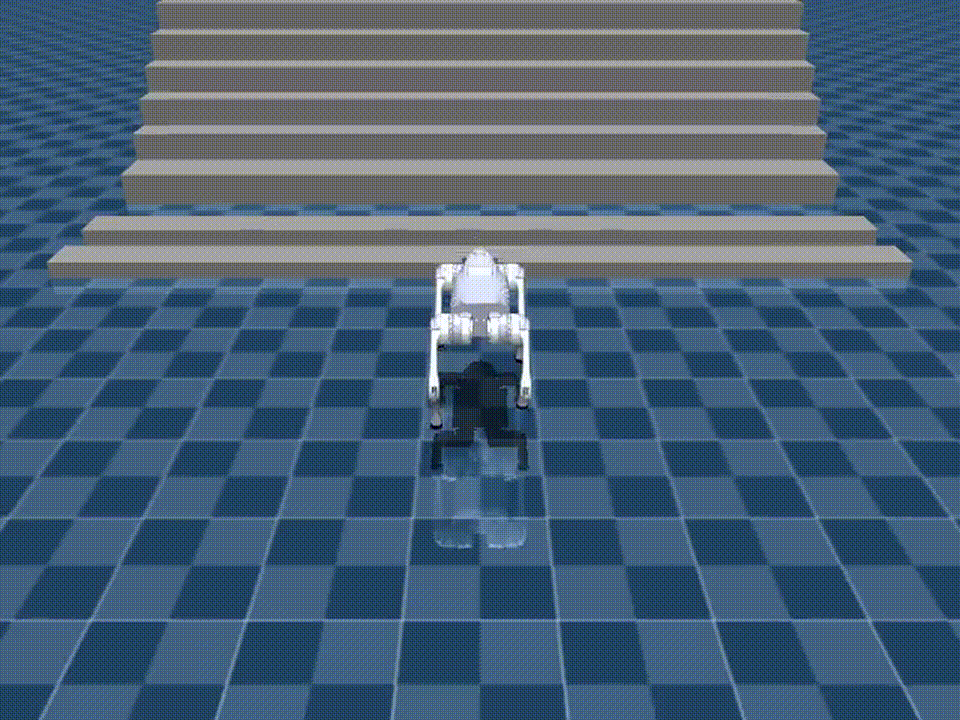

# sim2sim

This directory contains the current MuJoCo playback and validation path for exported Isaac policies.

## Current Scope

The framework is now used in two roles:

- keep the completed `Go2 -> MuJoCo` line as the validated quadruped baseline
- start the first humanoid migration line on `Unitree G1`

The target simulator remains:

- `unitree_mujoco`

## Framework Layout

- `asset_zoo/robots/`
  - robot specs and registration
- `actuators/`
  - actuator semantics
- `backends/`
  - MuJoCo interface
- `adapters.py`
  - actor observation and action translation
- `policies.py`
  - exported policy loaders
- `registry.py`
  - top-level robot registry
- `tools/play_policy.py`
  - run and optionally record a policy
- `tools/validate_robot_policy.py`
  - inspect + play in one command
- `tools/build_stair_scene.py`
  - parameterized MuJoCo stair scenes
- `tools/build_isaac_grid_scene.py`
  - Isaac-compatible tiled terrain scenes

## Go2 Baseline

The Go2 line is intentionally frozen as the first complete sim2sim baseline.

What is already validated there:

- official `unitree_mujoco` Go2 model integration
- Isaac-compatible observation/action adapter
- corrected joint order and action semantics
- target-aligned training variants on the Isaac side
- flat-ground heading-command alignment via `--heading-hold`
- MuJoCo playback and video recording

Reference artifacts:

- target playback:
  - 
- heading-command comparison:
  - no heading hold:
    - 
  - with heading hold:
    - 

That work remains here as a reusable baseline, but it is no longer the main active expansion target.

## G1 Migration

The active new work on this branch is `Unitree G1`.

Current G1 sim2sim progress:

- added `unitree_g1_unitree_mujoco` to the robot registry
- target model is the official 29-DoF G1 MuJoCo asset:
  - `/data2/sdam/unitree_mujoco/unitree_robots/g1/scene_29dof.xml`
- G1 joint ordering between Isaac and MuJoCo has been checked
- G1 actor observation mapping has been connected into the sim2sim adapter path
- default gains can now come from robot specs instead of only command-line overrides

Current G1 training-side focus:

- `RobotLab-Isaac-Velocity-Rough-Unitree-G1-v0`

Recent G1-side training adjustments on this branch:

- added a posture termination with `bad_orientation`
- re-enabled command curriculum on the rough task

## Command Semantics

One important lesson from the Go2 line also applies to G1:

- Isaac locomotion uses `heading_command=True`
- so the third command component seen by the actor is not always a fixed user-supplied `cmd_wz`
- instead, it can be generated online from heading error

Because of that, the current playback path supports:

- `--heading-hold`

This option restores source-side command semantics more closely by converting heading error into `cmd_wz` online during MuJoCo playback.

## Terrain Tools

The branch keeps the terrain builders developed during the Go2 stage because they are still useful for future humanoid validation:

- `tools/build_stair_scene.py`
  - single stair-family MuJoCo scene
- `tools/build_isaac_grid_scene.py`
  - Isaac-compatible tiled scene builder

These remain available, but the current G1 work has not yet been pushed through the full terrain-validation stage.

## Current Default Workflow

At the current stage, the preferred humanoid path is:

1. train `G1` in Isaac Lab
2. inspect the learned behavior in Isaac `play`
3. export the policy
4. run the exported policy in MuJoCo through this framework
5. then decide how much additional terrain and perception alignment is still necessary

## Current Decision

This directory should now be read as:

- completed Go2 baseline
- active G1 humanoid migration path

The next expansion work should happen on humanoids, not by continuously adding more Go2-specific branches.
