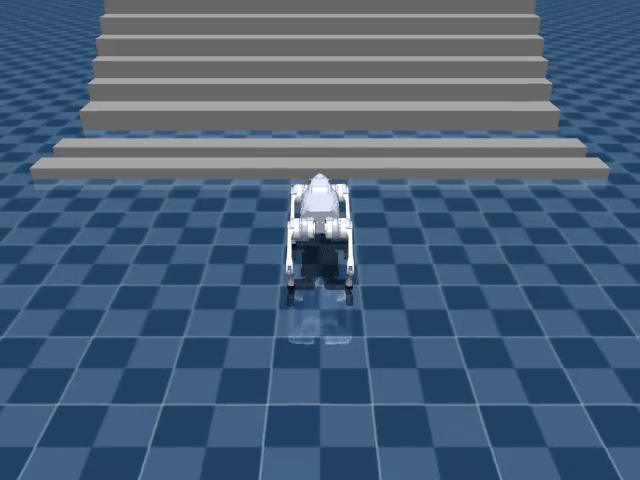
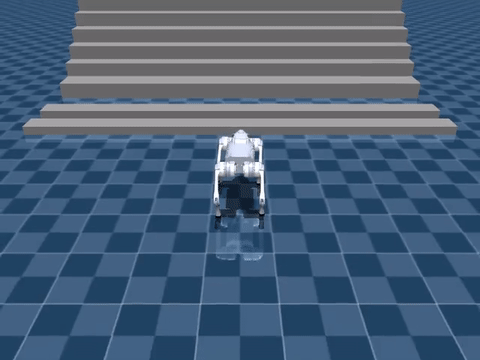
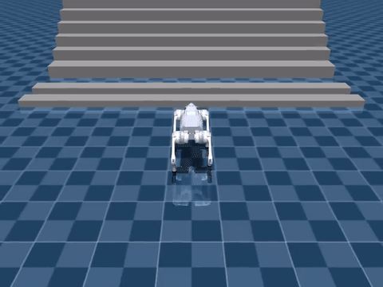
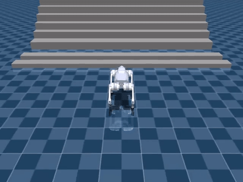
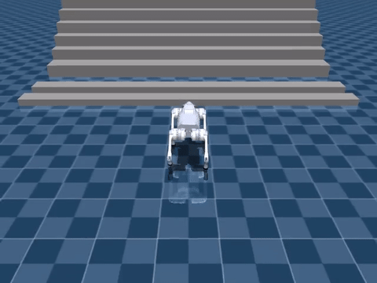
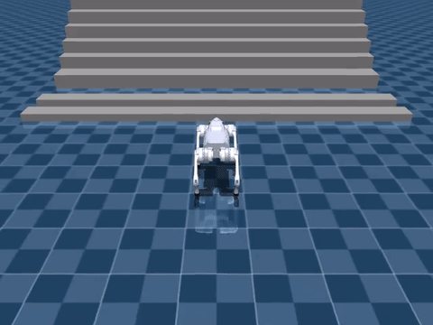

# sim2sim

This directory contains the current MuJoCo playback path for exported Isaac policies.

Current scope:

- target simulator: `unitree_mujoco`
- current robot: `Go2`
- current source policy family: Isaac Sim / Isaac Lab velocity policies
- current goal: play and inspect trained policies in MuJoCo, not train in MuJoCo

## Current Status

The sim2sim path is now intentionally narrowed to a single practical route:

- use the official Go2 model from `unitree_mujoco`
- keep a reusable adapter layer for Isaac policy observations and actions
- play exported `.onnx` / `.pt` policies inside MuJoCo
- support video recording for sharing results

Current validated example:

- source policy:
  - `logs/rsl_rl/unitree_go2_rough_armature/2026-03-26_10-44-03_go2_rough_armature_full/exported/policy.onnx`
- target scene:
  - `/data2/sdam/unitree_mujoco/unitree_robots/go2/scene.xml`
- preview:
  - [](videos/go2_unitree_mujoco_rough_armature_track.mp4)
- recorded playback:
  - [go2_unitree_mujoco_rough_armature_track.mp4](videos/go2_unitree_mujoco_rough_armature_track.mp4)

## Current Training Alignment Work

On the Isaac side, the branch now also includes a target-aligned Go2 rough task:

- `RobotLab-Isaac-Velocity-Rough-Unitree-Go2-Target-v0`

Compared with the earlier `rough+armature` variant, this task keeps the same rough terrain setup and curriculum logic, but moves the robot-side joint dynamics closer to the current `unitree_mujoco` target model by using:

- `armature = 0.01`
- `damping = 0.1`
- actuator friction term as an approximation of target-side `frictionloss = 0.2`

The intent is to reduce dynamics mismatch before exporting and validating the policy through this `sim2sim/` pipeline.

## Model Zoo

Current comparison set recorded in MuJoCo:

- flat full
  - [](videos/model_zoo/go2_flat_full.mp4)
- rough full
  - [](videos/model_zoo/go2_rough_full.mp4)
- rough with `illegal_contact`
  - [](videos/model_zoo/go2_rough_illegal_contact_on.mp4)
- stairs full
  - [](videos/model_zoo/go2_stairs_full.mp4)
- rough with `armature`
  - [](videos/model_zoo/go2_rough_armature_full.mp4)

## What Is Aligned

The current Go2 adapter is aligned to the Isaac training setup on these points:

- joint order:
  - `FR, FL, RR, RL`
- default joint pose:
  - hip `0.0`
  - thigh `0.8`
  - calf `-1.5`
- action semantics:
  - `target_pos = default_joint_pos + action * scale`
- action scale:
  - hip `0.125`
  - thigh/calf `0.25`
- actor observation dimension:
  - `45`
- control period:
  - `0.02`
- DCMotor-style clipping:
  - `effort_limit = 23.5`
  - `velocity_limit = 30.0`
  - `saturation_effort = 23.5`

The current playback chain is:

`policy -> target joint position -> PD torque -> DC motor clipping -> MuJoCo motor actuator`

## Layout

- `asset_zoo/robots/`
  - robot asset constants and adapter factory
- `actuators/`
  - reusable actuator semantics
- `backends/`
  - MuJoCo robot interface
- `tools/inspect_model.py`
  - inspect root body, joints, actuators
- `tools/play_policy.py`
  - run and optionally record a policy
- `tools/validate_robot_policy.py`
  - inspect + play in one command
- `adapters.py`
  - actor observation and action translation
- `policies.py`
  - `.onnx` / `.pt` loaders
- `registry.py`
  - top-level robot registry

## Usage

Inspect the current Go2 target model:

```bash
conda activate env_isaaclab
PYTHONPATH=/data2/sdam/robot_lab python sim2sim/tools/inspect_model.py \
  --robot unitree_go2_unitree_mujoco \
  --xml-path /data2/sdam/unitree_mujoco/unitree_robots/go2/scene.xml
```

Run the current rough+armature Go2 policy:

```bash
conda activate env_isaaclab
PYTHONPATH=/data2/sdam/robot_lab python sim2sim/tools/validate_robot_policy.py \
  --robot unitree_go2_unitree_mujoco \
  --policy /data2/sdam/robot_lab/logs/rsl_rl/unitree_go2_rough_armature/2026-03-26_10-44-03_go2_rough_armature_full/exported/policy.onnx \
  --xml-path /data2/sdam/unitree_mujoco/unitree_robots/go2/scene.xml \
  --render \
  --real-time
```

Record a rear-following playback video:

```bash
conda activate env_isaaclab
PYTHONPATH=/data2/sdam/robot_lab python sim2sim/tools/validate_robot_policy.py \
  --robot unitree_go2_unitree_mujoco \
  --policy /data2/sdam/robot_lab/logs/rsl_rl/unitree_go2_rough_armature/2026-03-26_10-44-03_go2_rough_armature_full/exported/policy.onnx \
  --xml-path /data2/sdam/unitree_mujoco/unitree_robots/go2/scene.xml \
  --steps 500 \
  --record-video /data2/sdam/robot_lab/sim2sim/videos/go2_unitree_mujoco_rough_armature_track.mp4 \
  --track-camera
```

## Current Notes

- The old URDF-to-MJCF prototype path has been removed from the active workflow.
- The current recommended target is the official `unitree_mujoco` Go2 asset.
- The current branch focus is policy validation and controller alignment, not MuJoCo-side training.
