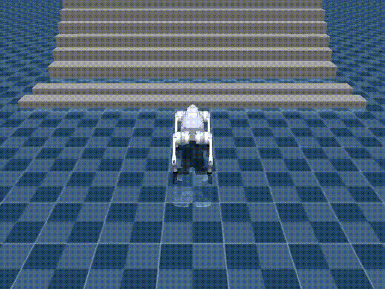

# sim2sim

This directory contains the current MuJoCo playback path for exported Isaac policies.

Current scope:

- target simulator: `unitree_mujoco`
- current robot: `Go2`
- current source policy family: Isaac Sim / Isaac Lab velocity policies
- current goal: play and inspect trained policies in MuJoCo, not train in MuJoCo

## Current Status

The sim2sim path is now intentionally narrowed to a single practical route:

- use the official Go2 model from `unitree_mujoco`
- keep a reusable adapter layer for Isaac policy observations and actions
- play exported `.onnx` / `.pt` policies inside MuJoCo
- support video recording for sharing results

Current validated example:

- source policy:
  - `logs/rsl_rl/unitree_go2_rough_target/2026-03-27_17-00-12_go2_rough_target_4096_50k/exported/policy.onnx`
- target scene:
  - `/data2/sdam/unitree_mujoco/unitree_robots/go2/scene.xml`
- preview:
  - [](videos/go2_unitree_mujoco_rough_target_track.mp4)
- recorded playback:
  - [go2_unitree_mujoco_rough_target_track.mp4](videos/go2_unitree_mujoco_rough_target_track.mp4)

## Current Training Alignment Work

On the Isaac side, the branch now also includes a target-aligned Go2 rough task:

- `RobotLab-Isaac-Velocity-Rough-Unitree-Go2-Target-v0`

Compared with the earlier `rough+armature` variant, this task keeps the same rough terrain setup and curriculum logic, but moves the robot-side joint dynamics closer to the current `unitree_mujoco` target model by using:

- `armature = 0.01`
- `damping = 0.1`
- actuator friction term as an approximation of target-side `frictionloss = 0.2`

The intent is to reduce dynamics mismatch before exporting and validating the policy through this `sim2sim/` pipeline.

The branch also now contains a stairs-heavy target-aligned source task:

- `RobotLab-Isaac-Velocity-Rough-Unitree-Go2-Target-StairsHeavy-v0`

This task keeps the current rough terrain curriculum enabled, but changes the terrain mix to:

- `pyramid_stairs = 0.35`
- `pyramid_stairs_inv = 0.35`
- `boxes = 0.10`
- `random_rough = 0.10`
- `hf_pyramid_slope = 0.05`
- `hf_pyramid_slope_inv = 0.05`

The purpose is to raise stair exposure frequency in the source simulator without collapsing the task into a pure stairs-only training setup.

## Latest Observation

Latest recorded target-aligned playback:

- [](videos/go2_unitree_mujoco_rough_target_track.mp4)

Observed behavior in the current `unitree_mujoco` scene:

- Go2 can lift and place both front legs onto the stair
- after the front half of the body reaches the stair, the robot tends to stall
- the hind legs fail to climb onto the stair and the robot remains stuck in a quasi-static posture

Current working hypotheses for the next validation round:

- stair geometry mismatch:
  - the Isaac-side stair curriculum uses generator-based stairs with `step_width = 0.3` and `step_height_range = (0.05, 0.23)`
  - the current MuJoCo target scene uses hand-authored box obstacles, not the same stair distribution
- stair tread-width mismatch:
  - the stair-height difference in the current MuJoCo scene is largely within the Isaac training range
  - however, the effective tread width / step spacing appears different from the training-side `step_width = 0.3`
  - this may strongly affect rear-leg transfer and foothold timing on the stair
- contact and friction mismatch:
  - Isaac training uses PhysX terrain materials plus material randomization
  - MuJoCo target side uses different geom friction and contact semantics
- residual controller / joint-dynamics mismatch:
  - although `armature`, `damping`, and friction-like resistance were moved closer to the target side, the actuator and contact behavior are still not fully identical
- task-distribution mismatch:
  - the policy may be robust enough to lift the front legs onto the stair but not yet robust enough to finish the full rear-leg transfer under the current MuJoCo target conditions

Updated interpretation after checking Isaac-side playback:

- this is not purely a sim2sim mismatch issue
- in the source training environment, Go2 can also fail on higher stairs while succeeding on lower ones
- this means the current policy already has a stair-height capability boundary in the source simulator
- the current MuJoCo gap is therefore better interpreted as:
  - policy capability limit on harder stairs
  - plus target-side geometry / contact / dynamics differences that further expose that limit

So the current failure mode should be treated as a combined effect, not blamed entirely on target-side mismatch.

At the current stage, the tread-width difference is recorded as a plausible contributor, but not yet identified as the primary cause.

## Model Zoo

Current comparison set recorded in MuJoCo:

- flat full
  - [](videos/model_zoo/go2_flat_full.mp4)
- rough full
  - [](videos/model_zoo/go2_rough_full.mp4)
- rough with `illegal_contact`
  - [](videos/model_zoo/go2_rough_illegal_contact_on.mp4)
- stairs full
  - [](videos/model_zoo/go2_stairs_full.mp4)
- rough with `armature`
  - [](videos/model_zoo/go2_rough_armature_full.mp4)

## What Is Aligned

The current Go2 adapter is aligned to the Isaac training setup on these points:

- joint order:
  - `FR, FL, RR, RL`
- default joint pose:
  - hip `0.0`
  - thigh `0.8`
  - calf `-1.5`
- action semantics:
  - `target_pos = default_joint_pos + action * scale`
- action scale:
  - hip `0.125`
  - thigh/calf `0.25`
- actor observation dimension:
  - `45`
- control period:
  - `0.02`
- DCMotor-style clipping:
  - `effort_limit = 23.5`
  - `velocity_limit = 30.0`
  - `saturation_effort = 23.5`

The current playback chain is:

`policy -> target joint position -> PD torque -> DC motor clipping -> MuJoCo motor actuator`

## Layout

- `asset_zoo/robots/`
  - robot asset constants and adapter factory
- `actuators/`
  - reusable actuator semantics
- `backends/`
  - MuJoCo robot interface
- `tools/inspect_model.py`
  - inspect root body, joints, actuators
- `tools/play_policy.py`
  - run and optionally record a policy
- `tools/build_terrain_scene.py`
  - wrap an exported Isaac terrain mesh into a MuJoCo scene XML
- `tools/evaluate_origins.py`
  - run the same policy over multiple exported terrain origins one by one
- `tools/validate_robot_policy.py`
  - inspect + play in one command
- `adapters.py`
  - actor observation and action translation
- `policies.py`
  - `.onnx` / `.pt` loaders
- `registry.py`
  - top-level robot registry

## Usage

Inspect the current Go2 target model:

```bash
conda activate env_isaaclab
PYTHONPATH=/data2/sdam/robot_lab python sim2sim/tools/inspect_model.py \
  --robot unitree_go2_unitree_mujoco \
  --xml-path /data2/sdam/unitree_mujoco/unitree_robots/go2/scene.xml
```

Run the current rough+armature Go2 policy:

```bash
conda activate env_isaaclab
PYTHONPATH=/data2/sdam/robot_lab python sim2sim/tools/validate_robot_policy.py \
  --robot unitree_go2_unitree_mujoco \
  --policy /data2/sdam/robot_lab/logs/rsl_rl/unitree_go2_rough_armature/2026-03-26_10-44-03_go2_rough_armature_full/exported/policy.onnx \
  --xml-path /data2/sdam/unitree_mujoco/unitree_robots/go2/scene.xml \
  --render \
  --real-time
```

Record a rear-following playback video:

```bash
conda activate env_isaaclab
PYTHONPATH=/data2/sdam/robot_lab python sim2sim/tools/validate_robot_policy.py \
  --robot unitree_go2_unitree_mujoco \
  --policy /data2/sdam/robot_lab/logs/rsl_rl/unitree_go2_rough_armature/2026-03-26_10-44-03_go2_rough_armature_full/exported/policy.onnx \
  --xml-path /data2/sdam/unitree_mujoco/unitree_robots/go2/scene.xml \
  --steps 500 \
  --record-video /data2/sdam/robot_lab/sim2sim/videos/go2_unitree_mujoco_rough_armature_track.mp4 \
  --track-camera
```

Export the exact terrain mesh used during Isaac-side play:

```bash
use_robot_lab

python scripts/reinforcement_learning/rsl_rl/play.py \
  --task=RobotLab-Isaac-Velocity-Rough-Unitree-Go2-Target-StairsHeavy-v0 \
  --checkpoint=/data2/sdam/robot_lab/logs/rsl_rl/unitree_go2_rough_target_stairs_heavy/<run>/model_49999.pt \
  --num_envs=1 \
  --export-terrain-mesh=/data2/sdam/robot_lab/sim2sim/terrains/go2_target_stairs_heavy_play.obj
```

This produces:

- exported terrain mesh, for example `go2_target_stairs_heavy_play.obj`
- terrain origins, for example `go2_target_stairs_heavy_play_origins.npy`
- terrain metadata JSON beside the mesh

Build a MuJoCo scene from that exported terrain:

```bash
conda activate env_isaaclab
PYTHONPATH=/data2/sdam/robot_lab python sim2sim/tools/build_terrain_scene.py \
  --terrain-mesh /data2/sdam/robot_lab/sim2sim/terrains/go2_target_stairs_heavy_play.obj \
  --output-xml /data2/sdam/robot_lab/sim2sim/terrains/go2_target_stairs_heavy_play_scene.xml
```

Evaluate one origin at a time on the same exported training terrain:

```bash
conda activate env_isaaclab
PYTHONPATH=/data2/sdam/robot_lab python sim2sim/tools/validate_robot_policy.py \
  --robot unitree_go2_unitree_mujoco \
  --policy /data2/sdam/robot_lab/logs/rsl_rl/unitree_go2_rough_target/2026-03-27_17-00-12_go2_rough_target_4096_50k/exported/policy.onnx \
  --xml-path /data2/sdam/robot_lab/sim2sim/terrains/go2_target_stairs_heavy_play_scene.xml \
  --origins-path /data2/sdam/robot_lab/sim2sim/terrains/go2_target_stairs_heavy_play_origins.npy \
  --spawn-origin-index 0 \
  --render \
  --real-time
```

If you want to remove command ambiguity during sim2sim validation, set the command explicitly:

```bash
--cmd-vx 0.5 --cmd-vy 0.0 --cmd-wz 0.0
```

For the current MuJoCo-side validation tools, the default command is already:

- `cmd_vx = 0.5`
- `cmd_vy = 0.0`
- `cmd_wz = 0.0`

So if Go2 still turns during sim2sim playback, the cause is more likely to be:

- terrain asymmetry
- contact asymmetry
- initial-state asymmetry
- or residual source/target dynamics mismatch

End-to-end example for the current stairs-heavy target task:

1. Export the exact terrain used during Isaac-side play:

```bash
use_robot_lab

python scripts/reinforcement_learning/rsl_rl/play.py \
  --task=RobotLab-Isaac-Velocity-Rough-Unitree-Go2-Target-StairsHeavy-v0 \
  --checkpoint=/data2/sdam/robot_lab/logs/rsl_rl/unitree_go2_rough_target_stairs_heavy/2026-03-31_09-00-08_go2_rough_target_stairs_heavy_4096_50k/model_49999.pt \
  --num_envs=1 \
  --export-terrain-mesh=/data2/sdam/robot_lab/sim2sim/terrains/go2_target_stairs_heavy_play.obj
```

2. Build a MuJoCo scene from that exported terrain:

```bash
conda activate env_isaaclab
PYTHONPATH=/data2/sdam/robot_lab python sim2sim/tools/build_terrain_scene.py \
  --terrain-mesh /data2/sdam/robot_lab/sim2sim/terrains/go2_target_stairs_heavy_play.obj \
  --output-xml /data2/sdam/robot_lab/sim2sim/terrains/go2_target_stairs_heavy_play_scene.xml
```

3. Validate one specific origin:

```bash
conda activate env_isaaclab
PYTHONPATH=/data2/sdam/robot_lab python sim2sim/tools/validate_robot_policy.py \
  --robot unitree_go2_unitree_mujoco \
  --policy /data2/sdam/robot_lab/logs/rsl_rl/unitree_go2_rough_target_stairs_heavy/2026-03-31_09-00-08_go2_rough_target_stairs_heavy_4096_50k/exported/policy.onnx \
  --xml-path /data2/sdam/robot_lab/sim2sim/terrains/go2_target_stairs_heavy_play_scene.xml \
  --origins-path /data2/sdam/robot_lab/sim2sim/terrains/go2_target_stairs_heavy_play_origins.npy \
  --spawn-origin-index 0 \
  --cmd-vx 0.5 \
  --cmd-vy 0.0 \
  --cmd-wz 0.0 \
  --render \
  --real-time
```

4. Sweep multiple origins on the same terrain:

```bash
conda activate env_isaaclab
PYTHONPATH=/data2/sdam/robot_lab python sim2sim/tools/evaluate_origins.py \
  --robot unitree_go2_unitree_mujoco \
  --policy /data2/sdam/robot_lab/logs/rsl_rl/unitree_go2_rough_target_stairs_heavy/2026-03-31_09-00-08_go2_rough_target_stairs_heavy_4096_50k/exported/policy.onnx \
  --xml-path /data2/sdam/robot_lab/sim2sim/terrains/go2_target_stairs_heavy_play_scene.xml \
  --origins-path /data2/sdam/robot_lab/sim2sim/terrains/go2_target_stairs_heavy_play_origins.npy \
  --index-start 0 \
  --index-stop 20 \
  --steps 500 \
  --record-dir /data2/sdam/robot_lab/sim2sim/videos/origin_sweep_stairs_heavy \
  --track-camera
```

Batch-evaluate multiple origins:

```bash
conda activate env_isaaclab
PYTHONPATH=/data2/sdam/robot_lab python sim2sim/tools/evaluate_origins.py \
  --robot unitree_go2_unitree_mujoco \
  --policy /data2/sdam/robot_lab/logs/rsl_rl/unitree_go2_rough_target/2026-03-27_17-00-12_go2_rough_target_4096_50k/exported/policy.onnx \
  --xml-path /data2/sdam/robot_lab/sim2sim/terrains/go2_target_stairs_heavy_play_scene.xml \
  --origins-path /data2/sdam/robot_lab/sim2sim/terrains/go2_target_stairs_heavy_play_origins.npy \
  --index-start 0 \
  --index-stop 20 \
  --steps 500 \
  --record-dir /data2/sdam/robot_lab/sim2sim/videos/origin_sweep \
  --track-camera
```

This is the current preferred way to compare source and target behavior:

- export the exact terrain instance used on the Isaac side
- reuse that same terrain as a MuJoCo mesh
- place one robot at one exported origin at a time
- compare behavior across multiple origins instead of forcing a multi-robot MuJoCo scene first

## Current Notes

- The old URDF-to-MJCF prototype path has been removed from the active workflow.
- The current recommended target is the official `unitree_mujoco` Go2 asset.
- The current branch focus is policy validation and controller alignment, not MuJoCo-side training.
